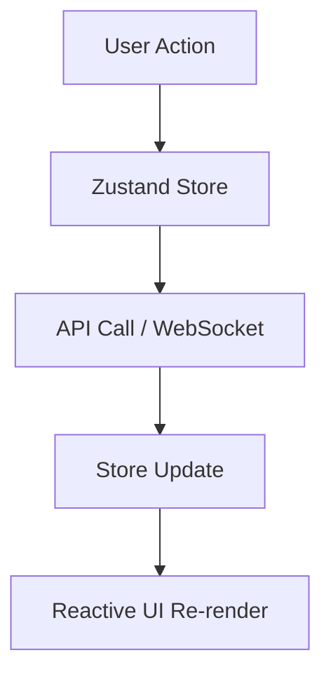

# NoteFlow Frontend 

<div align="center">

**A premium, high-performance note-taking interface with real-time collaboration, LaTeX support, and a sleek neomorphic design.**

[](https://nextjs.org/) [](https://www.typescriptlang.org/) [](https://tailwindcss.com/) [](https://github.com/pmndrs/zustand) [](https://opensource.org/licenses/MIT)

[Live Demo](#) · [Backend Repository](https://github.com/ZaudRehman/noteflow-backend-v1) · [Report Bug](https://github.com/ZaudRehman/noteflow-backend-v1/issues) · [Request Feature](https://github.com/ZaudRehman/noteflow-backend-v1/issues)

</div>

---

## 📖 Table of Contents

- [About](#-about-the-project)
- [Key Features](#-key-features)
- [Tech Stack](#️-tech-stack)
- [Architecture & State](#-architecture--state)
- [Application Map](#-application-map)
- [Getting Started](#-getting-started)
- [Design System](#-design-system)
- [Contributing](#-contributing)
- [Contact](#-contact)
- [License](#-license)

---

## 🎯 About The Project

NoteFlow is a modern collaborative note-taking application designed for speed, beauty, and utility. Built with **Next.js 16** and **Tailwind CSS**, it provides a distraction-free writing environment that supports everything from simple checklists to complex mathematical research.

### Why NoteFlow?

NoteFlow bridges the gap between simple text editors and heavy-duty documentation tools:
- **🚀 Real-Time Sync** - Collaborate with teammates instantly with live cursors and presence indicators.
- **🧪 Academic Ready** - First-class support for LaTeX equations and GFM Markdown.
- **✨ Glassmorphic UI** - A premium, dark-themed aesthetic that's easy on the eyes.
- **📱 Responsive & Fast** - Optimized for mobile and desktop with blazing-fast page transitions using Next.js App Router.

---

## ✨ Key Features

### ✒️ Writing Experience
- **Markdown Editor**: Powered by CodeMirror concepts with support for GFM.
- **LaTeX Intelligence**: Seamlessly render mathematical equations using `remark-math` and `rehype-katex`.
- **Note Previews**: Rich rendered previews in the dashboard with a gradient-fade thumbnail effect.
- **Document View**: Focused, centered writing layout for a professional document feel.

### 🤝 Seamless Collaboration
- **Global Presence**: See who's online across the entire application.
- **Note-Level Presence**: Avatars in the header show who is currently working on the same note.
- **Cursor Tracking**: Real-time position tracking (e.g., "User X is on Line 15").
- **Collaboration Notifications**: Instantly see when users join or leave a workspace.

### �️ Organization & History
- **Smart Tagging**: Create, update, and manage tags with many-to-many relationships.
- **Revision History**: Browse and restore previous versions of your notes with a single click.
- **Fast Search**: Optimized search across titles and content with debounced input.
- **Archiving**: Keep your dashboard tidy by archiving older notes.

---

## 🛠️ Tech Stack

- **Framework**: [Next.js 16](https://nextjs.org/) (App Router & Turbopack)
- **State Management**: [Zustand](https://github.com/pmndrs/zustand) (Modular architecture)
- **Styling**: [Tailwind CSS](https://tailwindcss.com/) with Glassmorphism
- **Real-Time**: Native WebSockets with robust reconnection logic
- **Editor & Rendering**: 
  - `react-markdown` for high-fidelity rendering
  - `lucide-react` for beautiful, consistent iconography
- **Data Fetching**: [Axios](https://axios-http.com/) with interceptors for auth

---

## 🏗️ Architecture & State

NoteFlow uses a **decentralized state management** approach to keep the UI snappy:

- **AuthStore**: Manages JWT tokens, user profiles, and session persistence via cookies.
- **UIStore**: Controls global UI state like sidebar collapse, active modals, and mobile drawers.
- **TagStore**: A centralized registry for user-defined tags to ensure consistency across pages.
- **NoteStore**: Handles local state for note lists, pagination, and active note metadata.



---

## 🗺️ Application Map

- **`/`**: Landing page with premium product overview.
- **`/login` / `/register`**: Auth gateway with robust validation.
- **`/dashboard`**: The core hub featuring note grid, quick actions, and sidebar.
- **`/dashboard/notes/[id]`**: The main writing environment.
- **`/dashboard/notes/[id]/history`**: The revision time-travel interface.
- **`/dashboard/search`**: Advanced filtering and global search results.

---

## 🚀 Getting Started

### 📋 Prerequisites
- **Node.js 18+**
- **npm** or **pnpm**
- **NoteFlow Backend** (Running locally or on Render)

### ⚙️ Installation

1. **Clone the repository**
   ```bash
   git clone https://github.com/ZaudRehman/noteflow-frontend.git
   cd noteflow-frontend
   ```

2. **Install dependencies**
   ```bash
   npm install
   ```

3. **Environment Setup**
   Create a `.env.local` file:
   ```env
   NEXT_PUBLIC_API_BASE_URL=https://your-api.com/api/v1
   NEXT_PUBLIC_WS_BASE_URL=wss://your-api.com/api/v1
   ```

4. **Run Development Server**
   ```bash
   npm run dev
   ```

---

## 🎨 Design System

Our custom design system is built for the "Dark Mode First" era:
- **Primary**: Pastel Lavender (#C77DFF)
- **Surface**: Anthracite Dark (#121212)
- **Accent**: Electric Blue / Soft Pink
- **Glass**: `backdrop-blur-md` with `bg-white/5`

---

## 📄 License

Distributed under the **MIT License**. See `LICENSE` for more information.

---

## 📧 Contact

**Zaud Rehman** - [@RehmanZaud](https://x.com/RehmanZaud) · [LinkedIn](https://www.linkedin.com/in/zaud-rehman-31514a288/) · zaudrehman@gmail.com

**Project Link**: [https://github.com/ZaudRehman/noteflow-frontend](https://github.com/ZaudRehman/noteflow-frontend)

---


## 🤝 Contributing

1. Fork the Project
2. Create your Feature Branch (`git checkout -b feature/AmazingFeature`)
3. Commit your Changes (`git commit -m 'Add some AmazingFeature'`)
4. Push to the Branch (`git push origin feature/AmazingFeature`)
5. Open a Pull Request

---

<div align="center">

**Built with ❤️ by [Zaud Rehman](https://github.com/ZaudRehman)**

</div>
